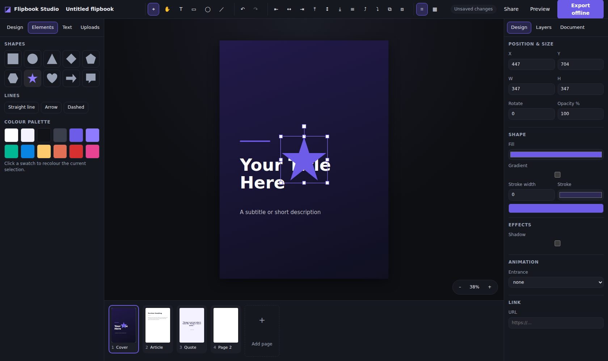
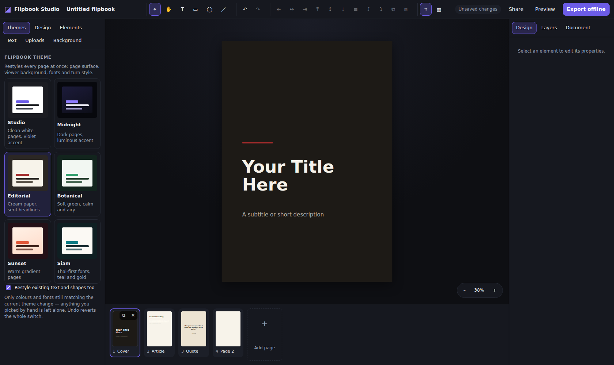
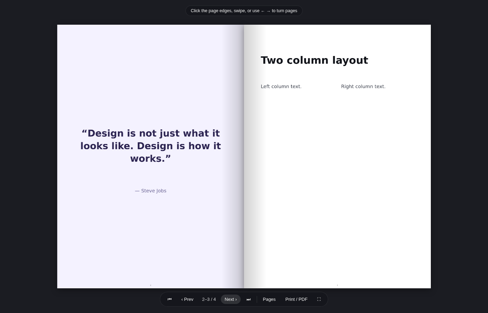

# Flipbook Studio

A web app for building multi-page flipbooks: a Canva-class design canvas for
laying out pages and graphics, a page-turn reader, Cloudflare-backed storage and
publishing, and a one-click **offline build** that runs from a folder with no
server and no internet.



## What it does

**Themes**
- 6 presets — Studio, Midnight, Editorial, Botanical, Sunset, Siam (Thai fonts)
- One click restyles the whole book: page surface, viewer background, fonts,
  accent colour and page-turn style
- Body, cover and tinted feature pages each move to the matching surface in the
  new theme, rather than every page being flattened to one colour
- Existing text and shapes are remapped **only** where they still match the
  outgoing theme — a colour you picked by hand survives; one undo reverts it all
- Page templates and the colour palette follow the active theme

**Design canvas**
- Text, images, **video**, 10 shape types, lines and arrows, raw-HTML embeds
- **Drag and drop**: drag an upload onto the page, or drop image/video files
  straight from the desktop — they land where you drop them, at their true
  aspect ratio
- Move, resize from 8 handles, and rotate — all correct for rotated elements
  (the opposite corner stays pinned, exactly like a design tool should behave)
- Smart guides that snap to page edges, page centre and other elements
- Marquee select, shift-click multi-select, grouping, z-order, lock and hide
- Align and distribute, arrow-key nudging, copy/paste/duplicate, undo/redo
- Per-element shadow, opacity, entrance animation and link
- Image filters: brightness, contrast, saturation, blur, grayscale
- Video: autoplay/loop/muted/controls and a poster image, bundled into exports
- Page templates (cover, article, two-column, hero, quote) and colour palettes

**Pages**
- Thumbnail strip with live page previews
- Drag to reorder, duplicate, delete, rename inline
- Page backgrounds: solid, gradient, or image — apply to one page or all
- **Paper texture** for the whole book: linen, fibre, grain, dots, grid or your
  own tiled image, with adjustable colour, strength and scale. The built-in
  textures are pure CSS, so they cost an offline export nothing at all
- Reader backdrop behind the book: solid, gradient or an image, bundled into
  offline exports along with everything else

**Reading**
- Two-page book spread with a 3D page turn, or single-page slide/fade
- Keyboard, click-the-edge and swipe navigation, thumbnail jump, fullscreen
- Publish to a public `/v/<slug>` link that stays in sync with every save

**Offline build**
- **ZIP** — `index.html` + `assets/`, opens by double-click from a USB stick
- **Single HTML file** — everything inlined as data URLs, easy to email
- Optional font embedding, so text renders identically with no network
- Includes a Print / PDF button that paginates one page per sheet
- Verified: the export renders, turns pages and loads its images with **all
  network requests blocked**



*Switching the whole book to the Editorial theme.*



*An exported offline build, opened straight from `file://`.*

## Architecture

```
flipbook/
├── src/
│   ├── shared/types.ts     document model — the contract for every layer
│   ├── lib/
│   │   ├── style.ts        appearance, shared by the editor and the exporter
│   │   ├── geometry.ts     rotation-aware resize, hit testing, snapping
│   │   ├── themes.ts       theme presets and the theme-to-theme remap
│   │   ├── templates.ts    page templates, built from the active theme
│   │   ├── factory.ts      element/page/document construction
│   │   ├── uploads.ts      upload plumbing shared by the panel and canvas drops
│   │   ├── api.ts          Worker API client
│   │   └── persistence.ts  debounced autosave with a local fallback
│   ├── store/editor.ts     editor state, history, selection, ordering
│   ├── components/         canvas, panels, reader, export dialog
│   └── export/
│       ├── html.ts         static HTML renderer for pages
│       ├── exportBundle.ts ZIP / single-file offline builds
│       └── runtime/        the dependency-free offline viewer (JS + CSS)
├── worker/index.ts         Cloudflare Worker: API + static asset serving
├── schema.sql              D1 schema
└── wrangler.toml           bindings for D1, R2, KV and static assets
```

The editor and the offline export share `lib/style.ts`, so what you see on the
canvas is what the exported flipbook renders — there is one definition of how an
element looks, not two.

### Cloudflare services

| Service | Used for |
| --- | --- |
| **Workers** | one Worker serves the SPA (Static Assets) and the `/api` routes |
| **D1** | project and asset metadata: listing, ownership, publish state |
| **R2** | document JSON and uploaded media, with no practical size ceiling |
| **KV** | published snapshots, read straight from the edge |

## Getting started

```bash
cd flipbook
npm install
npm run db:local          # create the tables in the local D1
npm run build
npx wrangler dev --local  # http://localhost:8787
```

For a fast edit loop run `npm run dev` (Vite, port 5173) alongside
`npm run dev:worker` (API, port 8787); Vite proxies `/api` across.

Deployment — including the resources already provisioned — is documented in
[docs/DEPLOY.md](docs/DEPLOY.md).

## Tests

`tests/e2e.mjs` drives a real browser against the app: it exercises resize,
rotate, marquee select, snapping, undo, page add/duplicate, image upload,
theme switching, video placement, drag-and-drop and the reader — then builds an
offline export, opens it from `file://` **with every http(s) request aborted**,
and checks that the pages render, the bundled image and video load, and the page
turn works.

```bash
npm run build
npx wrangler dev --local &     # serves the app and the API on :8787
npx playwright install chromium
npm run test:e2e
```

Set `CHROME_PATH` to reuse a Chromium that is already on the machine, and
`BASE_URL` to point at a deployed instance instead.

## Keyboard shortcuts

| | |
| --- | --- |
| `V` `H` `T` `R` `O` `L` | select, pan, text, rectangle, ellipse, line |
| `Space` + drag | pan the canvas |
| `Ctrl`/`Cmd` + scroll | zoom |
| `Ctrl+Z` / `Ctrl+Shift+Z` | undo / redo |
| `Ctrl+C` `Ctrl+V` `Ctrl+D` | copy, paste, duplicate |
| `Ctrl+G` / `Ctrl+Shift+G` | group / ungroup |
| `Ctrl+[` / `Ctrl+]` | send backward / bring forward |
| Arrows (`Shift` for 10px) | nudge |
| `Enter` | edit the selected text |
| `Delete` | delete selection |

## Limits and caveats

- **Access control is anonymous.** Projects belong to an `fb_owner` cookie, not
  to an account. It stops one browser reading another's projects; it is not
  authentication. See the note at the end of `docs/DEPLOY.md`.
- **Uploads are capped at 25 MB** per file, images and MP4/WebM only.
- **Video autoplay depends on the viewer's browser.** Autoplay forces muted,
  because that is the only way browsers allow it.
- **Font embedding needs network at export time.** If a webfont cannot be
  fetched the export falls back to a system stack rather than failing.
- Text elements hold plain text with one style per element — no rich-text runs
  or per-character formatting inside a single text box.
